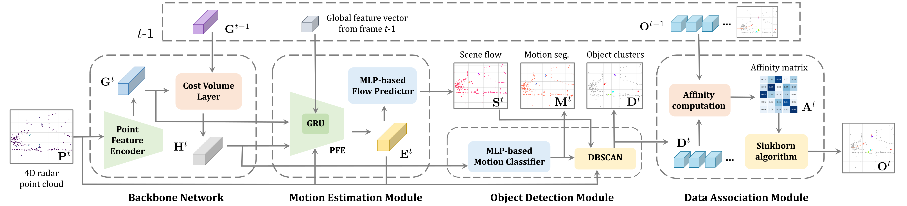

<p align="center">
<h1 align="center"><strong>
</p> <p align="center">
 RaTrack: Moving Object Detection and Tracking with 4D Radar Point Cloud</strong></h1>
  <p align="center">
    <a href='https://scholar.google.com/citations?user=MbzyV9YAAAAJ&hl=en' target='_blank'>Zhijun Pan*</a>&emsp; 
    <a href='https://toytiny.github.io/' target='_blank'>Fangqiang Ding*</a>&emsp;
    <a href='https://www.linkedin.com/in/hantao-zhong/' target='_blank'>Hantao Zhong*</a>&emsp;
    <a href='https://christopherlu.github.io/' target='_blank'>Chris Xiaoxuan Lu
    </a>&emsp;
    <br>
    *Equal Contribution
    <br>
    Royal College of Art&emsp;University of Edinburgh&emsp;University of Cambridge&emsp;
    University College London
  </p>
</p>

<div id="top" align="center">

[](https://arxiv.org/abs/2309.09737)
[](https://www.youtube.com/watch?v=IxfyCWyNhfw&feature=youtu.be)
[](https://github.com/LJacksonPan/RaTrack/blob/master/LICENSE)

</div>

## 📦 Method
|  | 
|:--:| 
| ***Figure 1. Overall network pipeline of RaTrack**. Given each 4D radar point cloud from the stream, we first apply a **backbone network** to encode intra- and inter-frame radar point cloud features. With the extracted features, our point-wise **motion estimation module** infers point-level scene flow as an explicit complement to augment the latent features of radar point clouds. Our advocated idea of class-agnostic detection without bounding boxes is introduced in the **object detection module** in which moving points are first identified and then used to detect moving objects via clustering. Finally, our **data association module** computes the affinity matrix with a learnable distance metric and then optimises the bipartite matching problem. The entire network is end-to-end trainable with a multi-task loss that incorporates three supervised subtasks: motion segmentation, scene flow estimation, and affinity matrix computation.* |

## 🔥 News
 - [2024-01-29] Our paper is accepted by [ICRA 2024](https://2024.ieee-icra.org/) 🎉.
 - [2024-01-29] Our paper can be seen here 👉 [arXiv](https://arxiv.org/abs/2309.09737).
 - [2024-03-13] We further improve the overall performance. Please check [Evaluation](#-evaluation).
 - [2024-03-13] Our paper demo video can be seen here 👉[video](https://youtu.be/IxfyCWyNhfw).
## 🔗 Citation
If you find our work useful in your research, please consider citing:


```bibtex
@InProceedings{pan2023moving,
    author    = {Pan, Zhijun and Ding, Fangqiang and Zhong, Hantao and Lu, Chris Xiaoxuan},
    title     = {Moving Object Detection and Tracking with 4D Radar Point Cloud},
    booktitle = {Proceedings of the IEEE International Conference on Robotics and Automation (ICRA)},
    year      = {2024},
}
```

## 📊 Qualitative results
Here are some GIFs to show our qualitative results on moving object detection and tracking based on 4D radar point clouds. Note that only moving objects with no less than five points. For more qualitative results, please refer to our [demo video](#demo-video).

<p align="center">

</p>

<p align="center">

</p>

## ✅ Dataset Preparation

First, please request and download the View of Delft (VoD) dataset from the [VoD official website](https://tudelft-iv.github.io/view-of-delft-dataset/). Unzip into the folder you prefer.

Please also obtain the tracking annotation from [VoD Github](https://github.com/tudelft-iv/view-of-delft-dataset/blob/main/docs/ANNOTATION.md). Unzip all the `.txt` tracking annotation files into the path: `PATH_TO_VOD_DATASET/view_of_delft_PUBLIC/lidar/training/label_2_tracking/`

The dataset folder structure should look like this:

```
view_of_delft_PUBLIC/
├── lidar
│   ├── ImageSets
│   ├── testing
│   └── training
│       ├── calib
│       ├── image_2
│       ├── label_2
│           ├── 00000.txt
│           ├── 00001.txt
│           ├── ...
│       ├── label_2_tracking
│           ├── 00000.txt
│           ├── 00001.txt
│           ├── ...
│       ├── pose
│       └── velodyne
├── radar
│   ├── testing
│   └── training
│       ├── calib
│       └── velodyne
├── radar_3frames
│   ├── testing
│   └── training
│       └── velodyne
└── radar_5frames
    ├── testing
    └── training
        └── velodyne
```


## 🚀 Getting Started

Please ensure you running with an Ubuntu machine with Nvidia GPU (at least 2GB VRAM). 
The code is tested with Ubuntu 22.04, and CUDA 11.8 with RTX 4090. Any other machine is not guaranteed to work.

To start, please ensure you have miniconda installed by following the official instructions [here](https://docs.anaconda.com/free/miniconda/miniconda-install/). 

First, clone the repository with the following command and navigate to the root directory of the project:

```bash
git clone git@github.com:LJacksonPan/RaTrack.git
cd RaTrack
```
Create a **RaTrack** environment with the following command:

```bash
conda env create -f environment.yml
```

This will setup a conda environment named `RaTrack` with CUDA 11.8, PyTorch2.2.0.

Installing the pointnet2 pytorch dependencies:

```bash
cd lib
python setup.py install
```

To train the model, please run:

```bash
python main.py
```
This will use the configuration file `config.yaml` to train the model.

To evaluate the model and generate the model predictions, please run:

```bash
python main.py --config configs_eval.yaml
```

## 🔎 Evaluation

To evaluate with the trained RaTrack model, please open the `configs_eval.yaml` and change the `model_path` to the path of the trained model. 
```yaml
model_path: 'checkpoint/track4d_radar/models/model.last.t7'
```


Then run the following command:

```bash
python main.py --config configs_eval.yaml
```

This will generate the predictions in the `results` folder. 

The evaluation results of the provided trained RaTrack model are following:

| Method    | SAMOTA | AMOTA | AMOTP | MOTA | MODA | MT   | ML   |
|-----------|--------|-------|-------|------|------|------|------|
| RaTrack   | 74.16  | 31.50 | 60.17 | 67.27| 77.83| 42.65| 14.71|
| RaTrack (Improved)| 80.33| 34.58 | 59.37 | 62.80| 77.07| 54.41| 13.24|

If you are interested in evaluating the predictions with our version of AB3DMOT evaluation, please contact us.

## 👏 Acknowledgements

We use the following open-source projects in our work:

- [Pointnet2.Pytorch](https://github.com/sshaoshuai/Pointnet2.PyTorch): We use the pytorch cuda implmentation of pointnet2 module.
- [view-of-delft-dataset](https://github.com/tudelft-iv/view-of-delft-dataset): We the documentation and development kit of the View of Delft (VoD) dataset to develop the model.
- [AB3DMOT](https://github.com/open-mmlab/OpenPCDet): we use AB3DMOT for evaluation metrics.
- [OpenPCDet](https://github.com/open-mmlab/OpenPCDet): we use OpenPCDet for baseline detetion model training and evaluating.